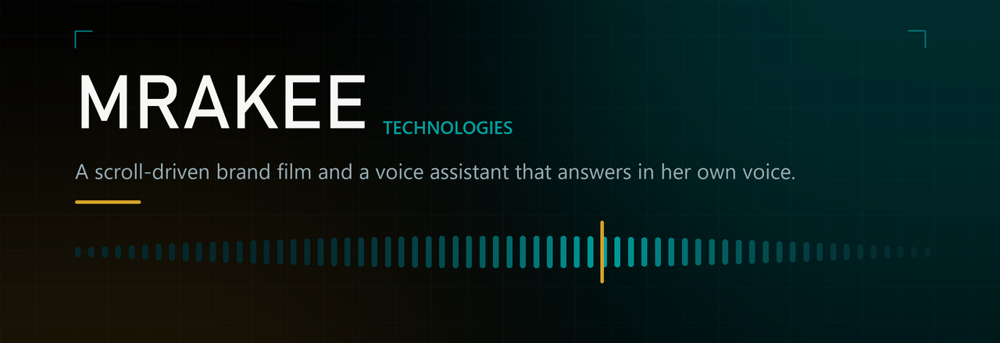
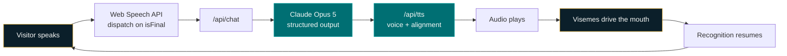
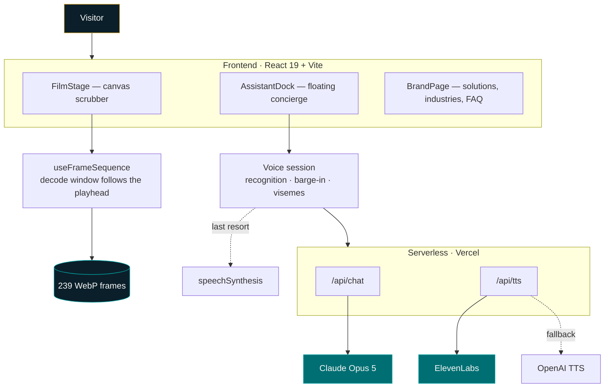
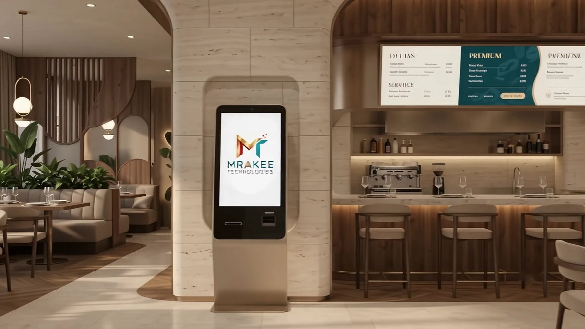

<div align="center">



<br />
<br />

### A brand film you scrub with the scroll, and a concierge who answers in her own voice.

<sub>DESIGN · INTEGRATE · CONNECT · PERFORM</sub>

<br />

[](https://mrakee-site.vercel.app/)
[](https://mrakee-site.vercel.app/kiosk)
[](https://github.com/AvengX/mrakee-site)

<br />


</div>

<br />

---

## Overview

**MRAKEE Technologies** is an AV systems integrator — the people who put the
displays, microphones, control systems and cabling into boardrooms, lecture
theatres, command centres and airport terminals. That presents a hard problem
for a website: they sell *the experience of a space*, and stock photography with
bullet points cannot demonstrate one.

So this site does not describe the product. It **is** one. The hero is a
239-frame commercial scrubbed frame-by-frame against the scroll wheel, so the
visitor drives the film at their own pace instead of watching a video play at
someone else's. Below it, a voice concierge listens, thinks, and answers aloud
with her mouth moving to the words — the same class of interactive surface the
company builds for its clients, running on the company's own homepage.

The engineering underneath is about latency and honesty. A scroll-scrubbed film
has to hold its frame budget while decoding 8 MB bitmaps. A voice assistant has
to answer before the pause makes people give up. And neither may invent a fact
about a business whose real credentials still sit with the client — so the
assistant is scoped to refuse rather than guess, and every number in this README
was measured rather than estimated.

<br />

## Key Features

|  | Feature | What it does |
|:--:|:--|:--|
| `▰` | **Scroll-scrubbed film** | 239 WebP frames at 1920×1080, drawn to canvas and scrubbed by ScrollTrigger. The visitor holds the playhead. |
| `◆` | **Continuous voice** | One click opens a session; after that it is hands-free. Speech in, reasoning, speech out, listening again — no button between turns. |
| `●` | **Real lip-sync** | Ten full-face viseme frames driven by character-level alignment and the audio's own amplitude, read from `currentTime` — never a timer. |
| `▸` | **Barge-in** | Talk over her and she stops mid-sentence. Echo cancellation is what stops her answering herself. |
| `◇` | **Grounded answers** | A schema constrains every reply, and the card list is filtered server-side against the nine real portfolios. |
| `▪` | **Motion-honest** | `prefers-reduced-motion` removes animation without removing content — every section stays reachable by wheel, touch and keyboard. |

<br />

## How It Works



**Speech in.** Recognition is held open as a *session*: the microphone opens
once and only recognition pauses between turns. The utterance is dispatched the
moment the engine marks it final, rather than waiting for the browser's
end-of-speech timer — which takes several hundred milliseconds off every
question, including "Hello".

**Reasoning.** `/api/chat` calls Claude with a cached system prompt and a Zod
schema, so the reply arrives as `{ reply, matches, handoff }` rather than prose
that has to be parsed. Anything about price, timing or specific past work
becomes a handoff, by instruction rather than by hope.

**Voice out.** `/api/tts` requests speech *with character-level timestamps*.
Those timestamps become a viseme timeline read from `media.currentTime`, so the
mouth cannot drift from the audio however the browser schedules frames.

<br />

## Tech Stack

| Layer | Technology |
|:--|:--|
| **Frontend** | React 19 · Vite 8 · plain JSX, no CSS framework |
| **Motion** | GSAP 3 + ScrollTrigger · Lenis, stepped from GSAP's ticker so there is one clock |
| **AI** | Claude Opus 5 via `@anthropic-ai/sdk` · Zod structured output · prompt caching |
| **Voice out** | ElevenLabs `eleven_multilingual_v2` → OpenAI `gpt-4o-mini-tts` → browser `speechSynthesis` |
| **Voice in** | Web Speech API · Web Audio `AnalyserNode` for amplitude and barge-in |
| **Media** | Canvas 2D · `createImageBitmap` · WebP frame sequence |
| **Backend** | Vercel serverless functions — `api/chat.js`, `api/tts.js` |
| **Tooling** | oxlint · Node 22 · GitHub Actions build check |

> **No database, deliberately.** The assistant's knowledge is a cached system
> prompt, not a vector store. The corpus is one company's published copy — small
> enough that retrieval would add a round trip and a failure mode without adding
> an answer.

<br />

## Architecture



<br />

## Showcase

<table>
<tr>
<td width="63%" valign="top">



**The film** — one of 239 frames. The generator's watermark is painted out
per-frame rather than cropped, so the full 16:9 picture survives instead of
losing 12% of every frame.

</td>
<td width="37%" valign="top">


**The concierge** — this render drives ten viseme frames, so her mouth moves to
the words she is actually speaking.

</td>
</tr>
</table>

> The kiosk touchscreen is a separate deliverable at
> **[`/kiosk`](https://mrakee-site.vercel.app/kiosk)** — a 1080×1920 interface
> authored at true device pixels and scaled as one piece.

<br />

## Installation

```bash
git clone https://github.com/AvengX/mrakee-site.git
cd mrakee-site
npm install
npm run dev
```

The site runs at `http://localhost:5173`. The film, the animation and the
**typed** assistant path all work immediately.

**The voice needs keys and a real deployment.** `api/chat.js` and `api/tts.js`
are Vercel functions — the Vite dev server does not execute them, so the
assistant answers only once deployed, or when run under `vercel dev`.

```bash
npm run build     # production bundle
npm run lint      # oxlint
npm run preview   # serve the build
```

<br />

## Configuration

Set these in **Vercel → Project → Settings → Environment Variables**, for
Production (and Preview if you want previews to talk too). Nothing here is read
by the browser: every one is used only inside `api/`, and the built client
bundle contains no key material.

| Variable | Required? | What it does |
|---|---|---|
| `ANTHROPIC_API_KEY` | **Yes** | Claude answers every question. Without it the assistant cannot reply at all. |
| `ELEVENLABS_API_KEY` | Optional | The natural voice. First choice — the one most listeners will not identify as synthetic. |
| `OPENAI_API_KEY` | Optional | Second-choice voice. Cheaper and close in quality. **Speech only** — Claude remains the brain. |

Claude is the brain in every configuration. The voice keys change what the
answer *sounds like*, never what it *says*.

> Vercel bakes environment variables in at build time, so **adding a key needs a
> redeploy**, not just a save.

<details>
<summary><b>If you set neither voice key</b></summary>

<br />

The assistant still speaks, using the browser's own `speechSynthesis` — free,
instant, and audibly synthetic. Nothing breaks; it is a downgrade, not a
failure.

</details>

<details>
<summary><b>Choosing a voice</b></summary>

<br />

Everything about the voice lives in `src/lib/voiceConfig.js` — the provider
order, the voice, the model, the delivery instruction. No provider or voice name
appears anywhere else in the app.

`VOICE.order` is tried in sequence and the first provider whose key is present
on the server wins, so you can add `ELEVENLABS_API_KEY` later and it takes over
from OpenAI on the next reply with no code change.

The ElevenLabs voice is **pinned** in `VOICE.elevenlabs.voiceId`. The server
calls text-to-speech with that id directly and never enumerates voices, so the
key needs only **Text to Speech** permission — **Voices → Read is not
required**.

To change the voice: elevenlabs.io → Voices → pick one → copy its Voice ID and
paste it into `voiceConfig.js`.

</details>

<br />

## Usage

| Action | What happens |
|:--|:--|
| **Scroll the hero** | You drive the film. Scroll speed is playback speed; stopping holds it on a frame. |
| **Open the concierge** | Bottom-right. The panel keeps its conversation when closed and reopened. |
| **Type a question** | Works with no microphone and no voice keys. Silent by design. |
| **Press "Talk to us"** | Grants the microphone once, then runs hands-free: speak, listen, speak again. |
| **Talk over her** | She stops and listens. No button needed. |
| **Append `?motion=on`** | Forces animation on when the OS asks for reduced motion. Useful when a section looks frozen. |

<br />

## Project Highlights

Measured in-browser against the running site. The method is given so each can be
re-run — none of these are estimates.

| Metric | Result | How it was measured |
|:--|:--|:--|
| **Scrub cost per frame** | **1.05 ms → 0.167 ms** median | Timing the paint loop across a 61-position scrub, before and after |
| **Worst-case frame** | **4.67 ms → 0.583 ms** | Same run, maximum tick |
| **Frame coverage held** | **61 / 61** distinct frames | Pixel-hashing the canvas at every scroll position |
| **Forced layout removed** | **0.388 ms → cached** | `clientWidth` read after style writes, against a cached value |
| **Watermark removal** | residual **58.4 → 7.8** | Persistent high-frequency residual, averaged over 40 frames |
| **Caption contrast** | worst case **2.43 : 1**, best ink of three | WCAG ratio over each caption's real backdrop, every frame of its window |
| **Reduced-motion content** | **0 px → 3,227 px** reachable | Scrollable width of the solutions rail with animations off |

<br />

## Roadmap

- [x] Scroll-scrubbed hero film, watermark painted rather than cropped
- [x] Continuous voice conversation with barge-in
- [x] Viseme lip-sync from character-level alignment
- [x] Kiosk touchscreen at `/kiosk`
- [x] Reduced-motion parity — no section hides content
- [ ] **Real contact details** — phone, email and address are still placeholders in the client's document
- [ ] **Contact form backend** — currently `mailto:`, with no delivery guarantee
- [ ] **Projects section** — named in the footer, no case studies supplied yet
- [ ] **Photography** — six of nine portfolios reuse a near-match image; Infrastructure has none
- [ ] **Prune retired dependencies** — `three` and `@react-three/*` are imported only by `src/_retired-3d/`
- [ ] **Streaming replies** — blocked while structured output drives the solution cards

<br />

## Developer

### Ayush Raj

Full-stack and applied-AI developer. Interested in the seam where interface
craft meets model behaviour — scroll-driven media, real-time voice, and
measuring things rather than guessing at them.

[](https://github.com/AvengX)

<!--
  LINKEDIN AND PORTFOLIO: I did not have verified URLs for these, and would
  rather leave a gap than publish a guess. Paste yours in and uncomment:

[](https://linkedin.com/in/YOUR_HANDLE)
[](https://YOUR_PORTFOLIO_URL)
-->

<br />

---

<div align="center">

### Built with curiosity, engineering, and a vision to turn AI into practical solutions.

<sub>Every metric above was measured. Nothing was estimated, and nothing was invented.</sub>

</div>
